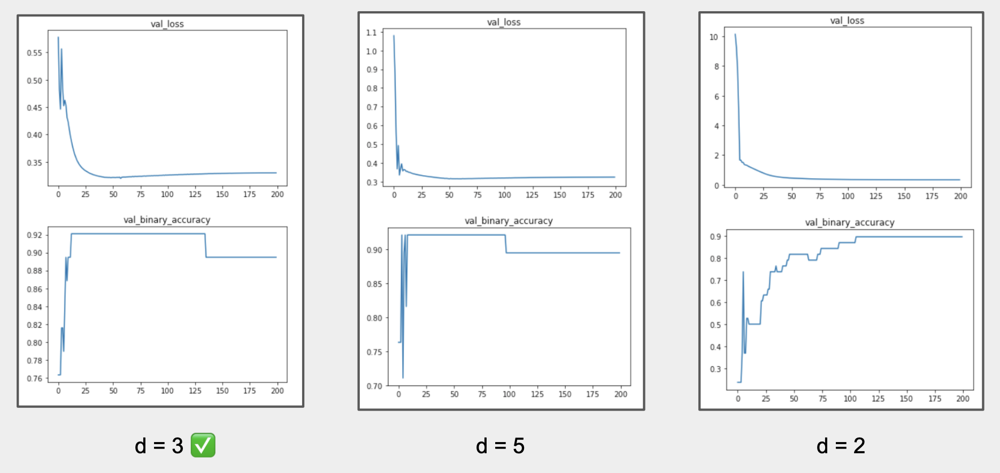

# E6998 Final Project: Deep Learning for Molecular Classification
## A description of the project 
The goal of the project is to study the power of deep learning to predict molecular properties. In achieving this goal, we first review and compare methods to perform deep learning on graphs. Then, we experiment various model architectures and learning algorithms. Lastly, we evaluate the trained models on the molecular property prediction task. 

Through the project, we hope to illustrate how to train deep learning models on graph input data and demonstrate the potential of using deep learning for scientific discoveries. 

## A description of the repository 
- `mutag` folder contains the raw data for training and validation
- `results` folder contains the experimental results of model tuning 
- `GNN.ipynb` contains the notebook for data preprocessing, as well as building & training & testing the models 

## Example commands to execute the code 
Apart from the standard deep learning libraries, `TF-GNN` pakcage needs to be installed in order to run the code in `GNN.ipynb`. `TF-GNN` can be installed via 
```
pip install tensorflow_gnn
``` 
## Results (including charts/tables) and your observations
### Depth

We see that both increasing and decreasing the number of message passing layers from default slightly worsen the performance; the middle ground of three message passing layers balances between the complexity of the model and the generalizability. 
### Dropout Rate

We observe that using a lower dropout rate of 0.1 increases the performance. This might because the model with three message passing layers is not deep enough to enjoy the generalization benefit achieved by a relatively high dropout rate. On the other hand, a higher dropout rate might make the model to be too sparse. 
### Learning Rate

We observe that decreasing (the initial) learning rate increases the performance. Since we are already using a learning rate decay, the increase in performance might because we got a good initialization of the network. 
### Optimizer

We found that using Adam as the optimizer achieves significantly better result than Adadelta and Adagrad (the network seems to be stale with the Adadelta and Adagrad as the optimizer). This might because Adam uses both the first and second moments of the gradients and hence is a better optimizer over Adadelta and Adagrad. 
